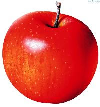

# Title level 1
## Title level2
### Title level3
###...
###### Title level6

way to write level 1 title
========================

way to write level 2 title
------------------------

A simple paragraph

## Change Line
if I want to change a line  
add 2+ blank and press enter

## Highlight
this way can be use in any place:  
I really love **chuwa**  
this cannot work in middle word:  
I really love __chuwa__

use *italic style in this way*  
or use _italic style in this way_

use both ***bold+italic***  
  
## Reference part
> to create reference part
> 
> in two lines
> 
>> and reference part inside another

## Ordered List
1. item1
2. item2
    1. small item1
    2. small item2
3. item3

## Unordered List (3 ways)
- first
- second

+ first
+ second

* first
* second
    - one
    - two
* third    

## Mark Code
mark `code` in this way  
``mark all `code` in this way``

## Horizontal Line
***
--------
_____

## Link
This is a link [Google](https://google.com "google link")。

This is a link ***[Google](https://google.com "google link")***。  
This is a link [`Google`](https://google.com "google link")。

<https://google.com>

## Image

## Special Character

&lt;  
&amp;

## inner HTML code
This is a regular paragraph.

<table>
    <tr>
        <td>Foo</td>
    </tr>
</table>

This is another regular paragraph.
