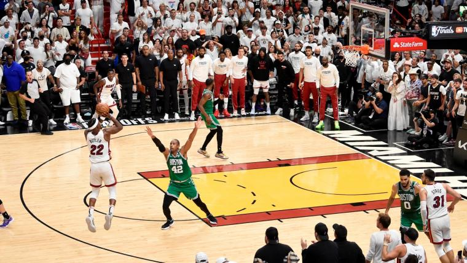

# HW1

## Question 1: markdown learning

### Test different text styling
**Bold**  <br>
*Italic*  <br>
~~Strikethrough~~ <br>
**Bold and _nested_ italic** <br>
<sub>This is a subscript text</sub> <br>
>Quoting <br>
>I continue Quoting, see see if there is a new line
`Quoting code`

```
multiple lines of code
main.py
```
Testing url links [Miami Heat homepage](https://www.nba.com/heat). <br>

 <br>

### Listing
- Miami Heat
* Jimmy Butler
+ Tyler Herro

1. Number testing
2. Number testing2
3. Number testing3

1. First list item
   - First nested list item
     - Second nested list item
       - Third nested list item

- [x] Tasks to do
- [ ] Tasks to do 2
- [x] Tasks to do 3
- [ ] #739 :tada:


       


