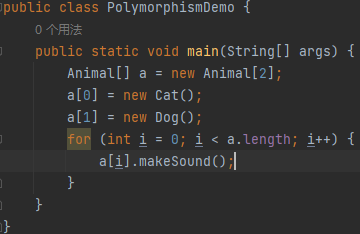

## Q1 Write up Example code to demonstrate the three foundmental concepts of OOP. 
#### Encapsulation

#### Polymorphism

#### Inheritance

## Q2 What is wrapper class in Java and Why we need wrapper class?
Wrapper class is a class provides an object-oriented representation of a primitive data type. We can convert the primitive data types into objects and to provide additional methods and functionalities for working with those data types.

## Q3 What is the difference between HashMap and HashTable?
1.HashMap is not synchronized, it is not thread-safe and can be accessed concurrently by multiple threads. But HashTable is synchronized and provides thread-safe operations.

2.HashMap allows null value for both keys and values, whereas HashTable does not allow null keys or values.

## Q4 What is String pool in Java and why we need String pool?
String pool is a special memory area that stores a pool of unique String objects. When a String is created using a literal, Java will checks if an equivalent String already exists in the pool. If yes, the existing String is returned instead of creating a new one.

Two reasons:
1.It can reduce memory consumption.
2.String pooling allows for efficient comparison of String objects using reference equality(==) instead of value equality(equals()), resulting in faster string operations and comparisons.

## Q5 What is Java garbage collection?
Java garbage collection is an automatic memory management mechanism that frees up objects that are no longer in use, preventing memory leaks and improving program performace.

## Q6 What are access modifiers and their scopes in Java?
public: The entity can be accessed from anywhere.
protected: The entity can be accessed within the same package or subclasses.
default: The entity can be accessed within the same package.
private: The entity can be accessed only within the same class.

## Q7 What is final key word? (Field, Method, Class)
1.field: a final field cannot be changed once assigned a value. It acts as a constant.
2.method: a final method cannot be overridden by subclasses. It is used to enforce the implementation of a method in the superclass.
3.class: a final class cannot be subclassed. It is used to prevent inheritance of a class. 

## Q8 What is static keyword? (Field, Method, Class). When do we usually use it?
1.field: a static field belongs to the class rather than instances of the class. It is shared among all instances of the class.
2.method: a static method belongs to the class and can be called without creating an instance of the class. It can access only other static members of the class.
3.class: there is no static class in Java.

## Q9 What is the differences between overriding and overloading?
#### Overriding:
1.Overriding occurs in inheritance when a subclass provide its own implementation of a method that is already defined in its superclass.
2.The method signature(name, return type and parameters) must be exactly the same in the subclass and superclass.
3.It determined at runtime based on the actual object type.

#### Overloading:
1. Occurs within a single class when there are multiple methods with the same name but different parameters.
2. The method signature must be different, either in terms of the number of parameters or their types.
3. It is determined at compile-time based on the method invocation and the arguments passed.

## Q10 What is the differences between super and this?
#### super
1.It is a keyword used to refer to the superclass of a subclass.
2.It is used to access or call the superclass's members that are overridden or hidden in the subclass.
3.It is often used to invoke the superclass's constructor from the subclass's constructor.

#### this
1.It is a keyword used to refer to the current instance of a class.
2.It is used to access or call the current object's members.
3.It is often used to differentiate between instance variables and local variables with the same name.

## Q11 What is the Java load sequence?
It refers to the order in which classes are loaded and initialized by the JVM, starting with the main class and recursively initializing its dependencies.

## Q12 What is Polymorphism ? And how Java implements it ?
It is the ability of an object to take on multiple forms, and it is implemented through method overriding and method overloading.

## Q13 What is Encapsulation ? How Java implements it? And why we need encapsulation?
Encapsulation in Java is the practice of bundling data and methods together within a class and controlling access to the data using access modifiers. It promotes data hiding, code organization, and code reusability.

## Q14 What is Interface and what is abstract class? What are the differences between them?
An interface in Java defines a contract for classes to implement certain methods, while an abstract class provides a partial implementation of a class with the ability to inherit and override its methods. The main difference is that a class can implement multiple interfaces, but can only inherit from a single abstract class.

## Q15 (OOD) Design a parking lot (put the code to codingQuestions/coding1 folder)
I've put the code into the codingQuestions/coding1 folder.

## Q16 What are Queue interface implementations and what are the differences and when to use what?
1.LinkedList: Implements a doubly-linked list and provides efficient insertion and removal operations. Suitable for general-purpose queue implementations.
2.PriorityQueue: Implements a priority queue based on the priority of elements. Elements are ordered based on a aomparator or their natural ordering. Suitable for scenarios where elements need to be processed based on their prioriy.