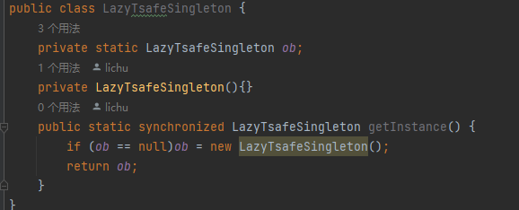

## Q2 What is the checked exception and unchecked exception in Java, could you give one example?
Checked exceptions are exceptions that are checked at compile-time, meaning the compiler enforces handling or declaring these exceptions. Examples of checked exceptions in Java include IOException, SQLException, and ClassNotFoundException.

Unchecked exceptions, also known as runtime exceptions, are exceptions that do not need to be declared or handled explicitly. They are subclasses of the RuntimeException class or its subclasses. Examples of unchecked exceptions in Java include NullPointerException, ArrayIndexOutOfBoundsException, and ArithmeticException.

## Q3 Can there be multiple finally blocks?
No, it can only have one finally blocks at most.

## Q4 When both catch and finally return values, what will be the final result ?
The the return values in the catch block would be ignored and the return values in the finally block would be the final result.

## Q5 What is Runtime/unchecked exception ? what is Compile/Checked Exception ?
Runtime exceptions occur during the runtime, it is not necessary to be handled. Compile Exceptions occur during the compile time, they are checked at compile-time and need to be handle.

## Q6 What is the difference between throw and throws?
throw is used to explicitly throw an exception within a method, indicating an exceptional condition has occurred.

throws is used in a method signature to declare the type of exceptions that the method might throw some exceptions, allowing the calling code to handle or propagate the exceptions.

## Q7 Run the below three pieces codes, Noticed the printed exceptions. why do we put the Null/Runtime exception before Exception?

The catch blocks are ordered from more specific to more general exceptions to ensure proper exception handling and avoid catching exceptions that should be handled separately.

## Q7 Why finally always be executed ?
Finally block is always executed in Java to ensure that certain code statements are executed regardless of whether an exception is thrown or not.

## Q8 What are the types of design patterns in Java ?
1.Creational Patterns
2.Structural Patterns
3.Behavioral Patterns

## Q9 What are the SOLID Principles ?
They are 5 design principles that help in creating software that is easy to maintain, understand and extend.

1.Single Responsibility Principle (SRP): A class should have only one reason to change, meaning it should have a single responsibility or purpose.

2.Open-Closed Principle (OCP): Software entities (classes, modules, functions) should be open for extension but closed for modification. In other words, new functionality should be added by extending existing code rather than modifying it.

3.Liskov Substitution Principle (LSP): Objects of a superclass should be replaceable with objects of its subclasses without affecting the correctness of the program. In other words, subclasses should be able to be used interchangeably with their base class.

4.Interface Segregation Principle (ISP): Clients should not be forced to depend on interfaces they do not use. Instead of having large, monolithic interfaces, smaller and more specific interfaces should be preferred.

5.Dependency Inversion Principle (DIP): High-level modules should not depend on low-level modules; both should depend on abstractions. Abstractions should not depend on details; details should depend on abstractions. This promotes decoupling and flexibility in the code.

## Q10 How can you achieve thread-safe singleton patterns in Java ?

## Q11 What do you understand by the Open-Closed Principle (OCP) ?
Software entities (classes, modules, functions) should be open for extension but closed for modification. In other words, new functionality should be added by extending existing code rather than modifying it.

## Q12 (SOLID-L)Liskov’s substitution principle states that if class B is a subtype of class A, then object of type A may be substituted with any object of type B. What does this actually mean? (from OA ) choose your answer.
1.  It mean that if the object of type A can do something, the object of type B could also be able tp 
perform the same thing
2.  It means that all the objects of type A could execute all the methods present in its subtype B
3.  It means if a method is present in class A, it should also be present in class B so that the object of 
type B could substitute object of type A.

I choose 3
