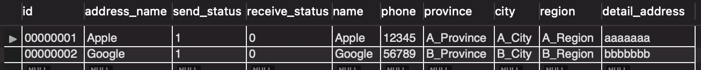

# Chuwa 0620 Assignment 6

### Zhizhou Xu

1. **SQL practice**  
   See sql script in /Coding directory. Here is a screenshot of all data entries after executing all commands.  
   

2. **Find 2 collection of APIs example. ie. Twitter, Paypal, Youtube etc.**

- Twitter

  1. Users API  
     Request method: `GET`  
     URL: https://api.twitter.com/1.1/users/show.json
  2. Tweets API
     Request methods: `POST` (for posting tweets), `GET` (for retrieving tweets), `DELETE` (for deleting tweets)  
     URLs:  
     Post a tweet: https://api.twitter.com/1.1/statuses/update.json  
     Retrieve a tweet: https://api.twitter.com/1.1/statuses/show/:id.json  
     Delete a tweet: https://api.twitter.com/1.1/statuses/destroy/:id.json
  3. Timelines API  
     Request method: `GET`  
     URLs:  
     Home timeline: https://api.twitter.com/1.1/statuses/home_timeline.json  
     User timeline: https://api.twitter.com/1.1/statuses/user_timeline.json  
     Mention timeline: https://api.twitter.com/1.1/statuses/mentions_timeline.json
  4. Search API  
     Request method: GET  
     URL: https://api.twitter.com/1.1/search/tweets.json
  5. Relationships API  
     Request methods: `GET` (to get relationships), `POST` (to follow a user), `DELETE` (to unfollow a user)  
     URLs:  
     Get relationship: https://api.twitter.com/1.1/friendships/show.json  
     Follow user: https://api.twitter.com/1.1/friendships/create.json  
     Unfollow user: https://api.twitter.com/1.1/friendships/destroy.json
  6. Media API  
     Request method: `POST`  
     URL: https://upload.twitter.com/1.1/media/upload.json
  7. Geo API  
     Request method: `GET`  
     URL: https://api.twitter.com/1.1/geo/search.json

- Paypal
  1. Payment API  
     Request methods: `POST`, `GET`, `PATCH`, `DELETE`  
     URL:  
     Create payment: https://api.paypal.com/v1/payments/payment  
     Execute payment: https://api.paypal.com/v1/payments/payment/{payment_id}/execute  
     Get payment details: https://api.paypal.com/v1/payments/payment/{payment_id}  
     Update payment: https://api.paypal.com/v1/payments/payment/{payment_id}
  2. Authorization API  
     Request methods: `POST`, `GET`, `PATCH`, `DELETE`  
     URL:
     Create authorization: https://api.paypal.com/v1/payments/payment/{payment_id}/authorization  
     Capture authorization: https://api.paypal.com/v1/payments/authorization/{authorization_id}/capture  
     Get authorization details: https://api.paypal.com/v1/payments/authorization/{authorization_id}  
     Void authorization: https://api.paypal.com/v1/payments/authorization/{authorization_id}/void
  3. Sale API  
     Request methods: `POST`, `GET`, `PATCH`, `DELETE`  
     URL:  
     Create sale: https://api.paypal.com/v1/payments/payment/{payment_id}/sale  
     Get sale details: https://api.paypal.com/v1/payments/sale/{sale_id}  
     Refund sale: https://api.paypal.com/v1/payments/sale/{sale_id}/refund
  4. Refund API  
     Request methods: `POST`, `GET`  
     URL:  
     Create refund: https://api.paypal.com/v1/payments/sale/{sale_id}/refund  
     Get refund details: https://api.paypal.com/v1/payments/refund/{refund_id}
  5. Webhooks API  
     Request methods: `POST`, `GET`, `DELETE`  
     URL:  
     Create webhook event: https://api.paypal.com/v1/notifications/webhooks  
     List webhook events: https://api.paypal.com/v1/notifications/webhooks  
     Get webhook event details: https://api.paypal.com/v1/notifications/webhooks/{webhook_id}  
     Delete webhook event: https://api.paypal.com/v1/notifications/webhooks/{webhook_id}

3. **Design a collection of APIs for a Blog Website, please specify `GET` `POST` `PUT` `DELETE`.**

- **Retrieve all blog posts:**  
   Method: `GET`  
   URL: `/api/posts`  
   Description: Retrieves a list of all blog posts available on the website.

- **Create a new blog post:**  
   Method: `POST`  
   URL: `/api/posts`  
   Description: Creates a new blog post with the provided data in the request body.

- **Retrieve a specific blog post:**  
   Method: `GET`  
   URL: `/api/posts/{post_id}`  
   Description: Retrieves the details of a specific blog post identified by its ID.

- **Update a blog post:**  
   Method: `PUT`  
   URL: `/api/posts/{post_id}`  
   Description: Updates the content of a specific blog post identified by its ID with the provided data in the request body.

- **Delete a blog post:**  
   Method: `DELETE`  
   URL: `/api/posts/{post_id}`  
   Description: Deletes a specific blog post identified by its ID.

- **Retrieve comments for a blog post:**  
   Method: `GET`  
   URL: `/api/posts/{post_id}/comments`  
   Description: Retrieves a list of comments associated with a specific blog post identified by its ID.

- **Add a comment to a blog post:**  
   Method: `POST`
  URL: `/api/posts/{post_id}/comments`  
   Description: Adds a new comment to a specific blog post identified by its ID with the provided data in the request body.

- **Update a comment on a blog post:**  
   Method: `PUT`  
   URL: `/api/posts/{post_id}/comments/{comment_id}`  
   Description: Updates the content of a specific comment on a blog post identified by both the post ID and the comment ID.

- **Delete a comment on a blog post:**  
   Method: `DELETE`  
   URL: `/api/posts/{post_id}/comments/{comment_id}`  
   Description: Deletes a specific comment on a blog post identified by both the post ID and the comment ID.

4. **Design APIs for the following features**

- **find the customer's payments, like credit card 1, credit card 2, paypal, Apple Pay.**  
   Method: `GET`  
   URL: `/api/customers/{customer_id}/payments`  
   Description: Retrieves the customer's payment methods, such as credit card 1, credit card 2, PayPal, and Apple Pay. The `{customer_id}` should be replaced with the unique identifier of the customer.
- **Find the customer's history orders from 10/10/2022 to 10/24/2022**  
   Method: `GET`  
   URL: `/api/customers/{customer_id}/orders?startDate=2022-10-10&endDate=2022-10-24`  
   Parameters:  
   start_date: The start date of the order history range (e.g., 2022-10-10).  
   end_date: The end date of the order history range (e.g., 2022-10-24).  
   Description: Retrieves the customer's order history within the specified date range. The {customer_id} should be replaced with the unique identifier of the customer.
- **find the customer's delievery addresses**  
   Method: `GET`  
   URL: `/api/customers/{customer_id}/addresses`  
   Description: Retrieves the customer's delivery addresses. The {customer_id} should be replaced with the unique identifier of the customer.
- **If I also want to get customer's default payment and default delievery address, what kind of the API (URL) should be?**  
   Method: `GET`  
   URL: `/api/customers/{customer_id}`  
   Description: Retrieves the customer's details, including their default payment method and delivery address. The {customer_id} should be replaced with the unique identifier of the customer.
